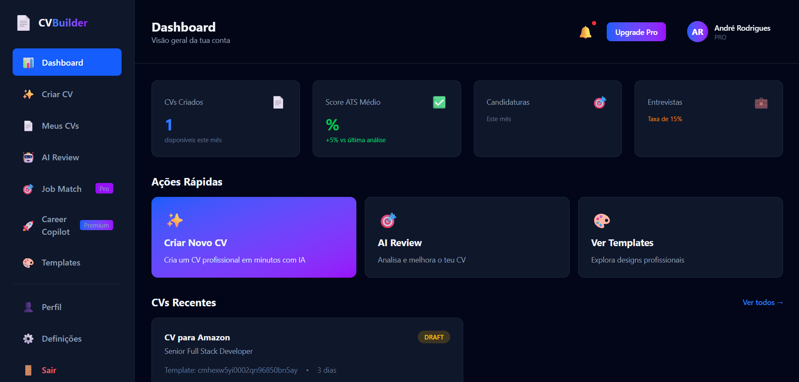

# 💼 CV Builder

**CV Builder** is a modern **full-stack web application** that helps users **create, customize, and optimize professional resumes**.  
With an intuitive interface and **AI-powered features**, it generates resumes that are **ATS-friendly** and **tailored to specific job descriptions**.

---

## 🖼️ Project Preview

---

## 🚀 Key Features

- 📝 **Resume Creation:** User-friendly interface to create, edit, and preview resumes in real time.  
- 🤖 **ATS Optimization:** Automatically generates resumes compatible with applicant tracking systems.  
- ✍️ **Description Enhancement:** Improves professional experience descriptions using AI.  
- 🧠 **Skill Suggestions:** Recommends skills based on the desired job position.  
- 🗣️ **Personalized Summary:** Generates professional summaries tailored to the user’s career goals.  
- ☁️ **Cloud Storage:** Stores generated resumes securely in **Cloudinary**.  
- 📄 **Export Options:** Download resumes in **PDF** and **DOCX** formats.  

---

## 🧱 Architecture

The application is divided into two main parts:

### 🖥️ **Frontend**
- Framework: [Vue 3](https://vuejs.org/)
- State Management: [Pinia](https://pinia.vuejs.org/)
- Styling: TailwindCSS + ShadCN + Lucide Icons
- Location: `frontend/`

### ⚙️ **Backend**
- Platform: [Node.js](https://nodejs.org/)
- Framework: [Express](https://expressjs.com/)
- ORM: [Prisma](https://www.prisma.io/)
- Database: PostgreSQL
- File Storage: Cloudinary (PDF/Docx hosting)
- Location: `backend/`
